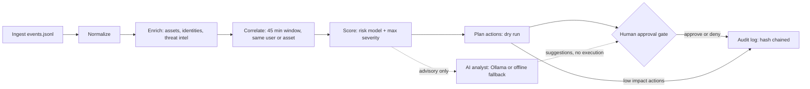

# Lab 1: Workflow and trust boundary

Trust boundary: everything left of the approval gate is automated and read-only or dry run. The AI box has no path to execute an action. High-impact actions only pass the gate on a named human decision.
